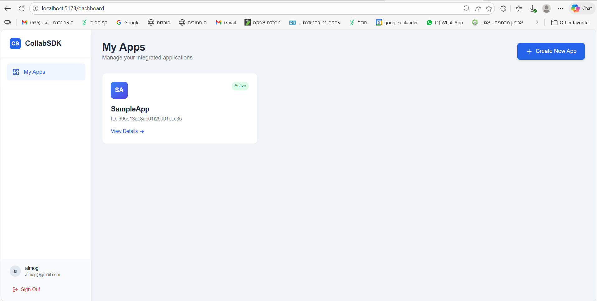

# CollabSession SDK

**A comprehensive real-time collaboration ecosystem.**

CollabSession SDK provides a complete solution for adding real-time features to Android applications. It includes a robust Backend API, a dedicated Android Library (SDK) for developers, and a modern Administration Portal to manage everything.

---

## 🚀 Key Features

- **Real-Time Synchronization:** Powered by Socket.io for instant data transfer.
- **Developer-Friendly SDK:** Simple Android library (`collab-sdk`) to drop into any project.
- **Administration Portal:** Secure dashboard to manage Apps, Developers, and active Sessions.
- **Secure:** JWT authentication for admins and API Key verification for SDK clients.
- **Scalable Architecture:** Built on Node.js/Express and MongoDB.

---

## 📂 Project Structure

The project is divided into three main components. Below is the detailed structure of each.

### 1. Backend Service (`backend/`)

The core engine handling API requests, database interactions, and WebSocket connections.

```text
backend/
├── controllers/      # Business logic for API endpoints
│   ├── appController.js
│   ├── authController.js
│   └── roomController.js
├── middleware/       # Authentication & validation middleware
│   └── authMiddleware.js
├── models/           # MongoDB Mongoose schemas
│   ├── App.js
│   ├── Developer.js
│   └── Room.js
├── routes/           # API route definitions
│   ├── appRoutes.js
│   ├── authRoutes.js
│   └── roomRoutes.js
├── sockets/          # Real-time event handlers
│   └── socketHandler.js
└── server.js         # Entry point & server configuration
```

### 2. Administration Portal (`frontend-portal/`)

A React-based dashboard for developers to manage their applications and view analytics.

```text
frontend-portal/
├── public/
├── src/
│   ├── components/   # Reusable UI components
│   │   ├── AnalyticsChart.jsx
│   │   ├── IntegrationGuide.jsx
│   │   └── RoomList.jsx
│   ├── context/      # Global state (Authentication)
│   │   └── AuthContext.jsx
│   ├── layouts/      # Page layouts (Sidebar, Header)
│   │   └── DashboardLayout.jsx
│   ├── pages/        # Main application views
│   │   ├── Dashboard.jsx
│   │   ├── Login.jsx
│   │   └── AppDetails.jsx
│   ├── App.jsx       # Routing configuration
│   └── main.jsx      # React entry point
└── tailwind.config.js
```

### 3. Android Ecosystem (`android/`)

Contains the SDK library and a sample application to demonstrate its usage.

```text
android/
├── app/              # Example Application
│   └── src/main/java/com/example/collabsessionapp/
│       ├── MainActivity.kt
│       └── ChatActivity.kt
└── collab-sdk/       # The Core Library
    └── src/main/java/com/example/collab_sdk/
        ├── CollabSessionSDK.kt
        └── SocketManager.kt
```

---

## 📸 Screenshots & Gallery

### Administration Portal

Manage your applications, view active sessions, and monitor usage.


_Above: The main dashboard showing active applications and real-time stats._


_Above: Detailed view of a specific application with integration keys._

### Android Integration

Seamlessly integrate chat and collaboration features into your mobile app.


_Above: The Example App running on an emulator, demonstrating real-time messaging._

---

## 🛠️ Technology Stack

| Component    | Tech Stack                                     |
| :----------- | :--------------------------------------------- |
| **Backend**  | Node.js, Express, Socket.io, MongoDB, Mongoose |
| **Frontend** | React, Vite, TailwindCSS, Recharts, Axios      |
| **Android**  | Kotlin, Coroutines, Retrofit, Socket.io Client |
| **DevOps**   | Render (Cloud), Vercel (Portal)                |

---

## 🏁 Getting Started

### Prerequisites

- Node.js (v18+)
- Android Studio (Ladybug or later)
- MongoDB Atlas Account

### Quick Setup

**1. Backend**

```bash
cd backend
npm install
# Create a .env file with MONGO_URI
npm start
```

**2. Frontend Portal**

```bash
cd frontend-portal
npm install
npm run dev
```

**3. Android**

Open the `android` folder in Android Studio and run the `app` module.

---

## 📚 Documentation

For detailed integration guides, please refer to the `docs/` folder:

- [📖 API Service Documentation](docs/api-service.md)
- [📱 Android Library Integration](docs/android-library.md)
- [💡 Example App Walkthrough](docs/example-app.md)

---

## 📄 License

This project is licensed under the MIT License - see the [LICENSE](LICENSE) file for details.
