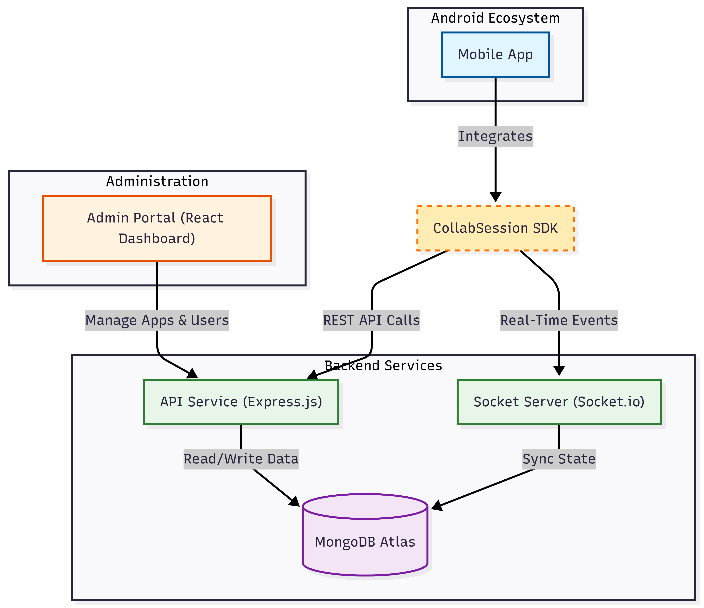
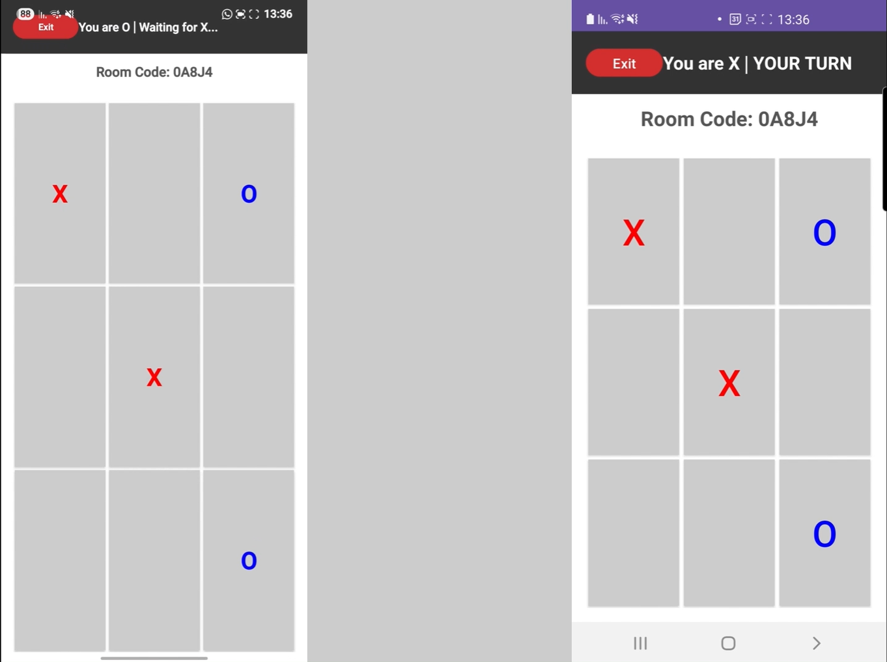

# CollabSession SDK

**A comprehensive real-time collaboration ecosystem.**

CollabSession SDK provides a complete solution for adding real-time features to Android applications. It includes a robust Backend API, a dedicated Android Library (SDK) for developers, and a modern Administration Portal to manage everything.

---

## 🚀 Key Features

- **Real-Time Synchronization:** Powered by Socket.io for instant data transfer.
- **Developer-Friendly SDK:** Simple Android library (`collab-sdk`) to drop into any project.
- **Administration Portal:** Secure dashboard to manage Apps, Developers, and active Sessions.
- **Secure:** JWT authentication for admins and API Key verification for SDK clients.
- **Scalable Architecture:** Built on Node.js/Express and MongoDB.

---

## 🎯 Target Audience & Use Cases

This SDK is designed for developers building **multi-user applications** that require seamless **real-time synchronization**.

**Ideal for:**

- **Multiplayer Games:** Synchronize game state (e.g., board games like Tic-Tac-Toe, chess) between players instantly.
- **Collaborative Tools:** Shared whiteboards, document editing, or team task management.
- **Live Interactive Apps:** Real-time polling, quizzes, or auctions where instant updates are critical.

---

## 🏗️ System Architecture


_Above: High-level overview of how the SDK, Backend, and Portal interact._

The project is divided into three main components. Below is the detailed structure of each.

### 1. Backend Service (`backend/`)

The core engine handling API requests, database interactions, and WebSocket connections.

```text
backend/
├── controllers/      # Business logic for API endpoints
├── middleware/       # Authentication & validation middleware
├── models/           # MongoDB Mongoose schemas
├── routes/           # API route definitions
├── sockets/          # Real-time event handlers
└── server.js         # Entry point & server configuration
```

### 2. Administration Portal (`frontend-portal/`)

A React-based dashboard for developers to manage their applications and view analytics.

```text
frontend-portal/
├── src/
│   ├── components/   # Reusable UI components
│   ├── context/      # Global state (Authentication)
│   ├── layouts/      # Page layouts (Sidebar, Header)
│   ├── pages/        # Main application views
│   └── App.jsx       # Routing configuration
```

### 3. Android Ecosystem (`android/`)

Contains the SDK library and a sample application to demonstrate its usage.

```text
android/
├── app/              # Example Application
└── collab-sdk/       # The Core Library
```

---

## 📸 Screenshots & Gallery

### Administration Portal

Manage your applications, view active sessions, and monitor usage.


_Above: The main dashboard showing active applications and real-time stats._


_Above: Detailed view of a specific application with integration keys._

### Android Integration

Seamlessly integrate real-time game state synchronization into your mobile app.


_Above: The Example App running on a device or emulator, demonstrating a multiplayer Tic-Tac-Toe game._

---

## 🌐 Live Demo

You can interact with the live deployed version of the system without any local setup:

- **Administration Portal:** [Launch Dashboard](https://collab-sdk-project-1.onrender.com)
- **Backend API:** `https://collab-sdk-project.onrender.com`
- **Socket.io Server:** `https://collab-sdk-project.onrender.com`

> **Note:** The backend is hosted on Render's free tier. If the service has been inactive, please allow up to 60 seconds for the server to wake up on the first request.

---

## 📚 Documentation

For detailed integration guides, please refer to the following:

- [📖 API Service Documentation](./api-service.md)
- [📱 Android Library Integration](./android-library.md)
- [💡 Example App Walkthrough](./example-app.md)

---

## 📄 License

This project is licensed under the MIT License - see the [LICENSE](../LICENSE) file for details.
